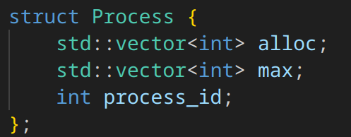
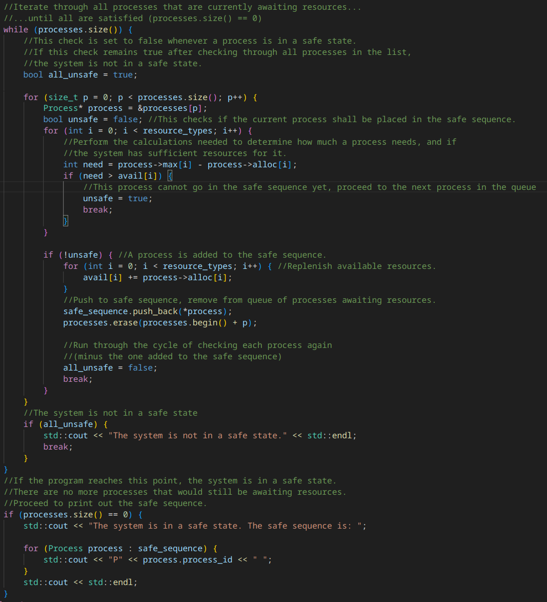

# Banker's Algorithm.

## Usage
Compile on a Linux/UNIX machine using g++:
- ``g++ banker.cpp -o banker``

Run the program using ``./banker``

Ensure the ``input.txt`` file exists in the current directory the program is being ran from.

## Explanation of Banker's Algorithm and Implementation
Banker's algorithm is used to determine the best route of action for running processes to ensure there are enough resources to satisfy each process. This ensures the system is in a safe state, and deadlock can not occur.

The program implements Banker's algorithm through parsing an ``input.txt`` file representing a snapshot of a system's state. 

The file is formatted as such:
- First line of the file is the amount of resources available. The amount of resources can be any amount, but must be separated by spaces.
- Separator line after the first line
- The third and fourth line represent the first process' allocated and maximum resources, respectively. Each process must have the same amount of types of resources as defined in the first line (available resources).
- Separator line after each process. Repeat the above step and this step for each process in the table.

Each process is parsed into an instance of the following struct:

Where ``alloc`` is a vector of how much of each resource type is currently allocated by the process,
and ``max`` is a vector of how much of each resource type a process needs,
and ``process_id`` is the process' ID (which is where they appear in the input file chronologically).

The implementation of banker's algorithm is described below:

The program first checks if the available resources are enough to satisfy a given process' needed resources (max - alloc). If there is at least one resource that cannot be provided (where need = max - alloc, and need > avail), then the process does not go into the safe sequence yet. The next process is then checked.

If a process is in the safe sequence, then it is added to it. It is then removed from the current queue of processes waiting to be assigned to the safe sequence. The queue is then checked again from the beginning.

If every process is determined to not be in the safe sequence, then the system is not in a safe state.

## Expected ouptut
Expected output given the default ``input.txt`` file provided in the repo:

Expected output given an ``input.txt`` file that represents a table of a system not in a safe state:

